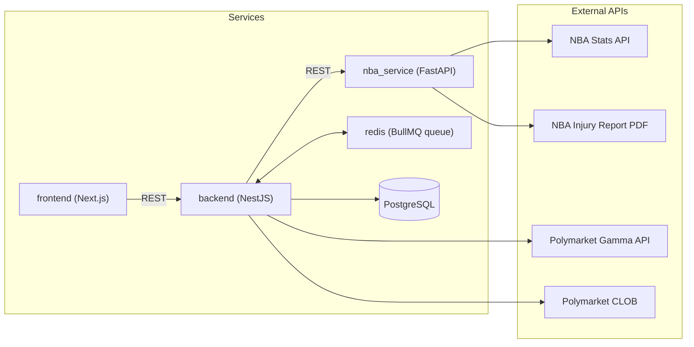
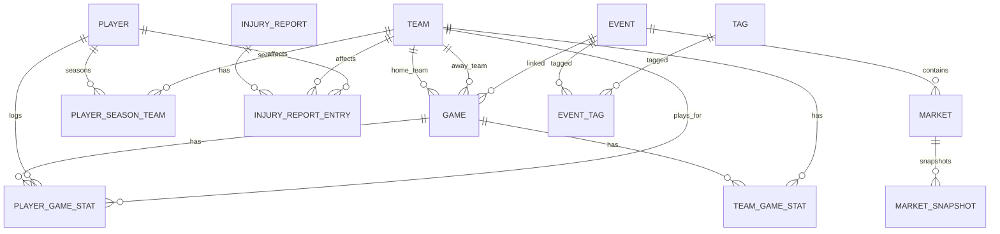

# Polymarket NBA Provider

這個專案把 **NBA 官方資料** 與 **Polymarket NBA 市場** 同步到本地 PostgreSQL，提供 API 與前端介面，讓你能快速查賽程、比分、球員數據、傷兵報告，以及對應的 Polymarket 市場與即時價量。

**你會得到什麼**
- 自動排程：定期同步 NBA 賽程/比分/球員數據與傷兵報告。
- Polymarket NBA 事件/市場資料落地與查詢。
- 可視化 UI：每日賽程、單場細節、球隊頁、球員頁。
- 內建 API 文件：Swagger `/docs`。

**核心元件**
| Service | 技術 | 預設埠 | 作用 |
| --- | --- | --- | --- |
| `backend` | NestJS + TypeORM + BullMQ | `3000` | 主 API、排程、資料寫入 DB |
| `frontend` | Next.js (App Router) | `3001` | UI (每日賽程、球隊/球員/比賽頁) |
| `nba_service` | FastAPI + `nba_api` | `8000` | NBA Stats API 代理與資料整形 |
| `db` | PostgreSQL 15 | `5432` | 資料落地 |
| `redis` | Redis 7 | `6379` | BullMQ queue |

**資料來源**
- Polymarket Gamma API：NBA 事件/市場。
- Polymarket CLOB：即時價格與 orderbook。
- NBA Stats API：賽程、比分、球隊、球員、Boxscore。
- NBA 官方傷兵報告 PDF：由 `nba_service` 擷取。

**資料流概念**
- NBA 同步：`backend` 透過 `nba_service` 拉 NBA API，寫入 `team` / `game` / `player` / `player_game_stat` / `team_game_stat` / `injury_report`。
- Polymarket 同步：`backend` 透過 Gamma API 抓 NBA events/markets，寫入 `events` / `markets` / `tags` / `event_tags`。
- UI 查詢：`frontend` 直接呼叫 `backend` API 顯示每日賽程、比賽與市場資訊。

**架構圖（Mermaid）**


**資料表關係圖（Mermaid ERD）**


**快速啟動（Docker）**
1. 啟動所有服務。
```bash
docker compose up --build
```
2. 確認服務。
- `http://localhost:3000/health`（Backend）
- `http://localhost:3001`（Frontend）
- `http://localhost:8000/health`（NBA service）
- Swagger: `http://localhost:3000/docs`（prod 預設關閉；需設 `SWAGGER_ENABLED=true`）

Backend 容器啟動前會先執行 DB migration（見 `backend/docker-entrypoint.sh`）。

**常用 API（Backend）**
NBA 查詢：
- 注意：所有 `YYYY-MM-DD` 的 `date/from/to` 預設以美東時間（`America/New_York`, ET）的「比賽日」解讀（可用 `NBA_DATE_INPUT_TZ` 覆寫）。
- `GET /nba/teams`
- `GET /nba/games?date=YYYY-MM-DD`
- `GET /nba/players?search=&teamId=&season=`
- `GET /nba/team-stats`、`GET /nba/team-game-stat`
- `GET /nba/player-stats`、`GET /nba/player-game-stat`
- `GET /nba/injury-reports`、`GET /nba/injury-reports/entries`
- `GET /nba/games/:id/markets`（比賽對應 Polymarket 市場）
- `GET /nba/games/context?date=YYYY-MM-DD&home=AAA&away=BBB`（整合比賽/球隊/球員/近期戰績/傷兵/市場）
- `POST /nba/analysis`（AI 賽局分析，需要 x402 付費；使用 `date+home+away`）

Polymarket 查詢：
- `GET /polymarket/events`、`GET /polymarket/markets`
- `GET /polymarket/price?marketIds=...`（CLOB live price）
- `GET /polymarket/orderbook?marketIds=...`

x402 / A2A Agent：
- `GET /.well-known/agent-card.json`（能力宣告與入口）
- `POST /a2a/rpc`（JSON-RPC shim；支援 `agent.getCard`, `tasks.create/get/events/cancel`，付費能力建議用 REST）
- `POST /a2a/tasks?capability=nba.matchup_brief`（免費；body 放 `input` 或直接放參數）
- `POST /a2a/tasks?capability=nba.matchup_full`（x402 付費）
- `GET /a2a/tasks/:id`（查狀態/結果）
- `GET /a2a/tasks/:id/events`（SSE 串流）
- `POST /a2a/tasks/:id/cancel`（取消，best-effort）

MCP Server（HTTP JSON-RPC）：
- `POST /mcp`
  - `initialize`
  - `tools/list`
  - `tools/call`（工具：`nba.getGameContext`, `pm.getPrices`, `analysis.nbaMatchup`, `analysis.computeEdge`, `pm.getRecentTrades`, `alerts.detectLargeTrades`, `ops.getFreshness`）

x402 付費端點：
- `POST /nba/analysis`（每次支付後可呼叫 AI 分析；使用 `date+home+away`）

**NBA Service API（FastAPI）**
- 注意：`date=YYYY-MM-DD` 預設以美東時間（ET）的比賽日傳入（與 NBA 官方 `GAME_DATE_EST` 一致）。
- `GET /scoreboard?date=YYYY-MM-DD`
- `GET /schedule?date=YYYY-MM-DD` 或 `GET /schedule?from=YYYY-MM-DD&to=YYYY-MM-DD`
- `GET /boxscore/traditional?game_id=...`
- `GET /boxscore/advanced?game_id=...`
- `GET /players/all?season=2024-25&current_only=false`
- `GET /players/info?player_id=...`
- `GET /teams/roster?team_id=...&season=2024-25`
- `GET /injury-report/latest`

**手動同步（Backend）**
HTTP 觸發：
- 注意：`date/from/to` 一律以美東時間（ET）的比賽日傳入。
- `POST /nba/sync/scoreboard?date=YYYY-MM-DD`
- `POST /nba/sync/final-results?date=YYYY-MM-DD`
- `POST /nba/sync/players?season=2024-25`
- `POST /nba/sync/player-season-teams?season=2024-25`
- `POST /nba/sync/player-game-stats?date=YYYY-MM-DD` 或 `?gameId=...`
- `POST /nba/sync/range?from=YYYY-MM-DD&to=YYYY-MM-DD&mode=both`
- `POST /nba/sync/injury-report`

腳本（Node）：
```bash
cd backend
npm run nba:sync:range -- --from=2026-02-01 --to=2026-02-07 --mode=both
npm run nba:sync:injury-report
npm run polymarket:sync
```

**排程與隊列（預設）**
- NBA scoreboard：`*/10 * * * *`
- NBA final results：`*/15 * * * *`
- NBA injury report：`30 * * * *`
- Polymarket NBA 同步：`0 * * * *`（每小時）
  - 條件 A：`active = true` 且 `end_date > now`
  - 條件 B：`start_date` 落在「今天～未來 7 天」

可透過環境變數覆寫，例如：
- `NBA_SCOREBOARD_CRON`、`NBA_FINAL_RESULTS_CRON`、`NBA_INJURY_REPORT_CRON`
- `POLYMARKET_NBA_SYNC_ENABLED`、`POLYMARKET_NBA_SYNC_CRON`
- `POLYMARKET_NBA_ACTIVE`、`POLYMARKET_NBA_CLOSED`
- `POLYMARKET_NBA_PAGE_SIZE`、`POLYMARKET_NBA_MAX_PAGES`
- `POLYMARKET_NBA_LOOKBACK_DAYS`
- `POLYMARKET_NBA_LOOKAHEAD_DAYS`（預設 0）
- `POLYMARKET_NBA_UPCOMING_DAYS`（預設 7）
- `NBA_FINAL_LOOKBACK_DAYS`、`NBA_SYNC_RANGE_MAX_DAYS`

**主要環境變數（Docker Compose 預設）**
- `DATABASE_URL=postgresql://postgres:postgres@db:5432/polymarket_nba`
- `NBA_SERVICE_BASE=http://nba_service:8000`
- `POLYMARKET_BASE=https://gamma-api.polymarket.com`
- `POLYMARKET_CLOB_BASE=https://clob.polymarket.com`
- `REDIS_HOST=redis`、`REDIS_PORT=6379`
- `NBA_INJURY_REPORT_INDEX_URL=https://official.nba.com/nba-injury-report-2020-21-season/`

**x402 付費設定（Base Sepolia testnet 預設）**
- `X402_ENABLED=true` 開啟 x402 paywall（預設 `false`）。
- `X402_PAY_TO=0x...` 收款地址（Base 鏈上的 USDC）。
- `CDP_API_KEY_ID=...`
- `CDP_API_KEY_SECRET=...`
- `X402_FACILITATOR_URL=...`（預設 `https://www.x402.org/facilitator`）
- `X402_NETWORK=eip155:84532`（Base Sepolia CAIP-2 network id）
- `X402_PRICE=$0.001`
- `X402_ANALYSIS_PRICE=$0.001`（可獨立設定 AI 分析價格）
- `X402_ANALYSIS_DESCRIPTION=NBA AI analysis access`
- `X402_SESSION_MODE=per_request`（每次呼叫都要付款；`disabled` 同義）
- `X402_SESSION_TTL_MS=43200000`（session 解鎖在 server memory 的保留時間）
- `X402_SESSION_COOKIE_NAME=x402_session`
- `CORS_ORIGIN=http://localhost:3001`（需允許 frontend 帶 cookie 的跨域請求）

**OpenAI 設定（AI 賽局分析）**
- `OPENAI_API_KEY=...`
- `OPENAI_MODEL=gpt-4o-mini`
- `OPENAI_TEMPERATURE=0.2`
- `OPENAI_MAX_OUTPUT_TOKENS=700`

**x402 行為說明**
- 以 cookie session 判斷「每個 session 一次」，成功付費後同一 session 不再要求付款。
- 目前是 backend memory 保存 session 狀態；重啟 backend 或多實例時會失效，正式環境建議改用 Redis。

**Repo 結構**
- `backend/`：NestJS API、DB migration、NBA/Polymarket 同步邏輯。
- `frontend/`：Next.js UI（每日賽程、球隊/球員/比賽細節）。
- `nba-service/`：FastAPI + `nba_api` 的 NBA Stats proxy 與傷兵報告解析。
- `docker-compose.yml`：一鍵啟動所有服務。

**深入文件**
- `nba-ingestion-guide.md`：Polymarket NBA 同步策略與參數建議。
- `nba-api-sync.md`：NBA API 同步流程與 DB entity 對照。
- `a2a-mcp-guide.md`：A2A 與 MCP 的使用流程、範例與注意事項。
