# NBA Sports Intelligence Agent

> **SF Agentic Commerce x402 Hackathon Submission**
>
> An autonomous AI agent that provides real-time NBA analytics, Polymarket predictions, and AI-powered betting insights — with native x402 micropayments for agent-to-agent commerce.

```
Built with: A2A Protocol | x402 Payments | MCP Tools | ERC-8004 Identity
```

[](https://www.8004scan.io/agents/base/14352)
[](https://www.x402.org/)
[](https://api-hoobs.polyox.io/.well-known/agent-card.json)

---

## The Problem

AI agents need real-time sports data to make informed predictions, but:
- Data access is fragmented across multiple APIs
- No standardized way for agents to discover and pay for sports intelligence
- Prediction markets like Polymarket lack contextualized analysis
- No verifiable agent identity for trustworthy data providers

## Our Solution

**NBA Sports Intelligence Agent** is a fully autonomous agent that:

1. **Aggregates** real-time NBA data (schedules, scores, player stats, injury reports)
2. **Analyzes** Polymarket NBA betting markets with live prices
3. **Provides** AI-powered matchup analysis and edge computation
4. **Monetizes** through x402 micropayments — other agents can autonomously pay for premium insights


---

## User Flow (OpenClaw Integration)

> **Demonstrates real-world workflow: Discover → Decide → Pay/Settle → Outcome**

```mermaid
flowchart TB
    subgraph DISCOVER["1️⃣ DISCOVER"]
        U1[User opens OpenClaw]
        U2[Browse NBA games today]
        U3[Select LAL vs BOS matchup]
    end

    subgraph DECIDE["2️⃣ DECIDE"]
        D1[View game context & injury report]
        D2[Check Polymarket odds]
        D3[Request AI analysis]
    end

    subgraph PAY["3️⃣ PAY / SETTLE"]
        P1[Receive 402 Payment Required]
        P2[Approve $0.05 USDC on Base]
        P3[x402 settles payment]
    end

    subgraph OUTCOME["4️⃣ OUTCOME"]
        O1[Receive AI matchup analysis]
        O2[View betting edge calculation]
        O3[Make informed decision]
    end

    U1 --> U2 --> U3
    U3 --> D1 --> D2 --> D3
    D3 --> P1 --> P2 --> P3
    P3 --> O1 --> O2 --> O3
```



### Step-by-Step Walkthrough

| Step | Action | Technical Detail |
|------|--------|------------------|
| **1. Discover** | User opens OpenClaw and browses today's NBA games | `GET /nba/games?date=2026-02-14` |
| **2. Select** | User picks LAL vs BOS matchup | UI displays game context |
| **3. Free Preview** | View basic stats, injury reports, Polymarket odds | `nba.matchup_brief` (free) |
| **4. Request Analysis** | User clicks "Get AI Analysis" | `POST /a2a/tasks?capability=nba.matchup_full` |
| **5. Pay** | Wallet prompts $0.05 USDC payment | x402 → Base network → USDC transfer |
| **6. Settle** | Payment confirmed on-chain | x402 facilitator returns signature |
| **7. Outcome** | Full AI analysis delivered | GPT-4o matchup breakdown + edge calculation |
| **8. Decide** | User makes informed betting decision | Armed with data + AI insights |

### OpenClaw Screenshots Flow

```
┌─────────────────┐     ┌─────────────────┐     ┌─────────────────┐     ┌─────────────────┐
│   🏀 Games      │     │   📊 Preview    │     │   💳 Pay x402   │     │   🤖 AI Result  │
│                 │     │                 │     │                 │     │                 │
│  LAL vs BOS     │ ──► │  Stats & Odds   │ ──► │  $0.05 USDC     │ ──► │  Full Analysis  │
│  GSW vs MIA     │     │  Injury Report  │     │  on Base        │     │  Edge: +3.2%    │
│  ...            │     │  Market Price   │     │  [Approve]      │     │  Confidence: 78%│
└─────────────────┘     └─────────────────┘     └─────────────────┘     └─────────────────┘
      DISCOVER               DECIDE                PAY/SETTLE              OUTCOME
```

---

## Agentic Commerce Features

### 1. A2A Protocol (Agent-to-Agent)

Fully compliant A2A implementation enabling autonomous agent discovery and task execution.

```bash
# Discover agent capabilities
curl -s https://api-hoobs.polyox.io/.well-known/agent-card.json | jq

# Create a task (JSON-RPC)
curl -sX POST https://api-hoobs.polyox.io/a2a/rpc \
  -H 'content-type: application/json' \
  -d '{
    "jsonrpc": "2.0",
    "id": 1,
    "method": "tasks.create",
    "params": {
      "capability": "nba.matchup_brief",
      "input": { "date": "2026-02-13", "home": "LAL", "away": "BOS" }
    }
  }'
```

**Supported A2A Methods:**
| Method | Description |
|--------|-------------|
| `agent.getCard` | Discover capabilities and endpoints |
| `tasks.create` | Create analysis task |
| `tasks.get` | Poll task status |
| `tasks.events` | SSE streaming for real-time updates |
| `tasks.cancel` | Cancel running task |

### 2. x402 Native Payments

Seamless micropayments for premium AI analysis — agents can autonomously pay without human intervention.

```
HTTP/1.1 402 Payment Required
payment-required: {"x402Version":2,"accepts":[{"scheme":"exact","network":"eip155:84532","amount":"1000","payTo":"0x..."}]}
```

**Payment Flow:**


**Pricing:**
| Capability | Price | Description |
|-----------|-------|-------------|
| `nba.matchup_brief` | Free | Quick game overview |
| `nba.matchup_full` | $0.05 USDC | Full AI analysis with model outputs |
| `/nba/analysis` | $0.001 USDC | Single game AI breakdown |

### 3. MCP Tools Interface

Standard MCP (Model Context Protocol) for LLM tool-use integration.

```bash
# List available tools
curl -sX POST https://api-hoobs.polyox.io/mcp \
  -H 'content-type: application/json' \
  -d '{"jsonrpc":"2.0","id":1,"method":"tools/list"}'
```

**Available Tools:**
| Tool | Description |
|------|-------------|
| `nba.getGameContext` | Get comprehensive game context |
| `pm.getPrices` | Fetch Polymarket live prices |
| `analysis.nbaMatchup` | AI-powered matchup analysis |
| `analysis.computeEdge` | Calculate betting edge |
| `pm.getRecentTrades` | Recent market activity |
| `alerts.detectLargeTrades` | Whale movement alerts |
| `ops.getFreshness` | Data freshness check |

### 4. ERC-8004 Agent Identity

On-chain verifiable agent identity for trust and discoverability.

**Registered on Base Mainnet:** [View on 8004scan](https://www.8004scan.io/agents/base/14352)

[](https://www.8004scan.io/agents/base/14352)

```json
{
  "type": "https://eips.ethereum.org/EIPS/eip-8004#registration-v1",
  "name": "NBA Sports Intelligence Agent",
  "description": "Real-time NBA analytics and Polymarket insights with x402 payments",
  "services": [
    {"name": "A2A", "endpoint": "https://api-hoobs.polyox.io/.well-known/agent-card.json"},
    {"name": "MCP", "endpoint": "https://api-hoobs.polyox.io/mcp"},
    {"name": "web", "endpoint": "https://app-hoobs.polyox.io"}
  ],
  "x402support": true,
  "capabilities": ["nba.matchup_brief", "nba.matchup_full"]
}
```

---

## Technical Architecture

### System Overview


### Data Model


### Service Stack

| Service | Technology | Port | Purpose |
|---------|-----------|------|---------|
| `backend` | NestJS + TypeORM + BullMQ | 3000 | Main API, scheduling, x402 |
| `frontend` | Next.js (App Router) | 3001 | UI + A2A/MCP consoles |
| `nba_service` | FastAPI + nba_api | 8000 | NBA Stats proxy |
| `db` | PostgreSQL 15 | 5432 | Data persistence |
| `redis` | Redis 7 | 6379 | Job queue |

---

## Quick Start

### Docker (Recommended)

```bash
# Clone the repository
git clone https://github.com/LINWANHAW/polymarket_nba_provider.git
cd polymarket_nba_provider

# Start all services
docker compose up --build

# Verify services
curl http://localhost:3000/health  # Backend
curl http://localhost:8000/health  # NBA Service
open http://localhost:3001          # Frontend
```

### Environment Variables

```bash
# x402 Payment Configuration (Base Sepolia testnet)
X402_ENABLED=true
X402_PAY_TO=0x...                    # Your USDC recipient address
X402_NETWORK=eip155:84532            # Base Sepolia
X402_PRICE=$0.001
CDP_API_KEY_ID=...                   # Coinbase Developer Platform
CDP_API_KEY_SECRET=...

# AI Analysis
OPENAI_API_KEY=...
OPENAI_MODEL=gpt-4o-mini

# Data Sources
DATABASE_URL=postgresql://postgres:postgres@db:5432/polymarket_nba
NBA_SERVICE_BASE=http://nba_service:8000
POLYMARKET_BASE=https://gamma-api.polymarket.com
```

---

## Use Cases

### 1. Trading Agent Integration

A trading agent can autonomously:
1. Discover this agent via A2A
2. Request matchup analysis
3. Pay via x402 micropayment
4. Execute trades based on insights

```python
# Example: Trading agent workflow
async def get_betting_edge(game_date, home_team, away_team):
    # 1. Create analysis task
    task = await a2a_client.create_task(
        capability="nba.matchup_full",
        input={"date": game_date, "home": home_team, "away": away_team}
    )

    # 2. x402 payment handled automatically by client

    # 3. Get results
    result = await a2a_client.get_task(task.id)
    return result.output
```

### 2. Research Agent Workflow


### 3. MCP Tool Use (Claude/GPT)

```bash
# Claude Code can use this as an MCP server
{
  "mcpServers": {
    "nba-sports": {
      "url": "https://api-hoobs.polyox.io/mcp"
    }
  }
}
```

---

## Demo

### Live Endpoints

| Endpoint | URL |
|----------|-----|
| **API** | https://api-hoobs.polyox.io |
| **App** | https://app-hoobs.polyox.io |
| **ERC-8004** | https://www.8004scan.io/agents/base/14352 |
| **Agent Card** | https://api-hoobs.polyox.io/.well-known/agent-card.json |
| **A2A Console** | https://app-hoobs.polyox.io/a2a |
| **MCP Console** | https://app-hoobs.polyox.io/mcp |

### Quick Test Commands

```bash
# 1. Check agent capabilities
curl -s https://api-hoobs.polyox.io/.well-known/agent-card.json | jq '.capabilities'

# 2. Create a free task
curl -sX POST 'https://api-hoobs.polyox.io/a2a/tasks?capability=nba.matchup_brief' \
  -H 'content-type: application/json' \
  -d '{"input":{"date":"2026-02-13","home":"LAL","away":"BOS"}}'

# 3. List MCP tools
curl -sX POST https://api-hoobs.polyox.io/mcp \
  -H 'content-type: application/json' \
  -d '{"jsonrpc":"2.0","id":1,"method":"tools/list"}'

# 4. Get game context via MCP
curl -sX POST https://api-hoobs.polyox.io/mcp \
  -H 'content-type: application/json' \
  -d '{
    "jsonrpc":"2.0","id":2,"method":"tools/call",
    "params":{"name":"nba.getGameContext","arguments":{"date":"2026-02-13","home":"LAL","away":"BOS"}}
  }'
```

---

## Hackathon Alignment

### Technology Stack Match

| Hackathon Requirement | Our Implementation |
|----------------------|-------------------|
| **x402 Payments** | Native x402 middleware with Coinbase facilitator |
| **A2A Protocol** | Full A2A JSON-RPC + REST implementation |
| **ERC-8004** | [Registered on Base Mainnet](https://www.8004scan.io/agents/base/14352) |
| **Agents/AI** | GPT-4o powered matchup analysis |
| **Real-world utility** | Live NBA data + Polymarket integration |

### Judging Criteria Alignment

- **Innovation**: First sports intelligence agent with native x402 payments
- **Technical Implementation**: Production-ready multi-service architecture
- **x402 Integration**: Seamless micropayments for premium insights
- **Real-world Applicability**: Live data, live markets, actionable insights
- **Agent Interoperability**: A2A + MCP for maximum compatibility

---

## Roadmap

- [x] Core NBA data ingestion
- [x] Polymarket market integration
- [x] A2A protocol implementation
- [x] x402 payment middleware
- [x] MCP tools endpoint
- [x] AI-powered analysis
- [x] ERC-8004 on-chain registration (Base)
- [ ] SKALE integration for gasless transactions
- [ ] Multi-agent orchestration demo
- [ ] Virtuals Agent Launchpad integration

---

## Team

Built for the **SF Agentic Commerce x402 Hackathon** by passionate builders exploring the intersection of AI agents, sports analytics, and decentralized payments.

---

## Resources

- [A2A + MCP Usage Guide](./a2a-mcp-guide.md)
- [NBA Ingestion Guide](./nba-ingestion-guide.md)
- [NBA API Sync Documentation](./nba-api-sync.md)
- [x402 Protocol Specification](https://www.x402.org/)
- [ERC-8004 Standard](https://eips.ethereum.org/EIPS/eip-8004)

---

## License

MIT

---

> **Demo Video**: [Coming Soon]
>
> **Submission**: [DoraHacks x402 Hackathon](https://dorahacks.io/hackathon/x402)
